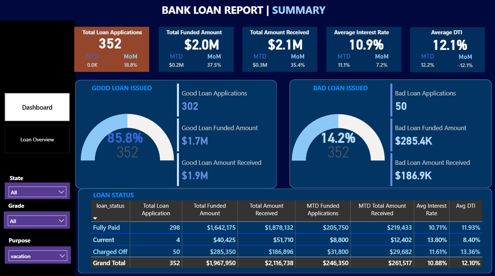

# Loan Portfolio Insights (Power BI + SQL)

This repository hosts an **interactive Loan Portfolio Insights project** built using **Power BI** and **SQL**.  
It provides **clear, visual insights** into loan performance, repayments, and borrower trends, helping banks and financial institutions make informed decisions.  

---

## Project Highlights  

The project consists of **two main dashboards**: **Summary** and **Loan Overview**, each offering unique insights into the loan portfolio.  

- **Summary**: High-level KPIs to monitor overall loan performance.  
- **Loan Overview**: Detailed analysis of borrower trends and funding patterns.  

---

## Dashboards & Key Metrics  

### **1. Summary**  

Provides a **snapshot of loan performance** with key metrics and status breakdowns.  

**Key Metrics:**  
- **Total Loan Applications** – Month-to-date (MTD) and month-over-month (MoM) comparisons.  
- **Total Funded Amount** – Total loans disbursed to borrowers.  
- **Total Amount Received** – Loan repayments collected.  
- **Average Interest Rate** – Trends in interest rates across loans.  
- **Average Debt-to-Income (DTI) Ratio** – Borrower repayment ability.  

**Loan Status Table:**  
- Distribution of loans as **Fully Paid**, **Current**, or **Charged Off**.  
- Shows funded and received amounts for each status.  

---

### **2. Loan Overview**  

Focuses on **borrower trends and loan patterns** to help identify potential risks and opportunities.  

**Visual Insights Include:**  
- **Monthly Loan Trends** – Loan disbursement patterns over time.  
- **Loan Term Split (36 vs 60 months)** – Comparison of short-term vs long-term loans.  
- **Employment Length** – Analysis of borrower job stability.  
- **Home Ownership** – Impact of borrower property ownership on loan performance.  
- **Loan Purpose & Grade** – Breakdown of loans by purpose and risk grade.  

---

## Dashboard Visuals

## Dataset Information  

The dataset includes essential fields for analyzing loan behavior and borrower profiles:  
- **Loan Details:** Loan ID, Amount, Interest Rate, Term, Status  
- **Borrower Info:** State, Grade, Purpose, Annual Income, Employment Length, Home Ownership  
- **Financial Ratios:** Debt-to-Income (DTI)  

These fields allow comprehensive analysis of **repayment trends, risk assessment, and borrower segmentation**.  

---

## SQL Analysis  

SQL was used to **extract, aggregate, and summarize the loan data** to feed into the dashboards.  

Using SQL, the following insights were generated:  
- Total loan applications and funded amounts overall, monthly, and by status.  
- Loan repayment totals and average interest rates.  
- Borrower risk analysis via DTI and loan status (Fully Paid, Current, Charged Off).  
- Trends over time such as monthly loan disbursement patterns.  
- Borrower segmentation by state, term, employment length, home ownership, purpose, and grade.  

These SQL-powered analyses provided the **foundation for the interactive dashboards**, enabling fast and accurate visualization of loan performance.  

---

**Conclusion:**  
This project demonstrates a **complete loan portfolio analysis workflow** using **SQL** for data extraction and **Power BI** for visualization.  
It enables tracking of **loan performance, borrower behavior, and repayment trends**, making it a strong addition to a data analytics portfolio.

---

**Created by**
Rishabh Duggal
